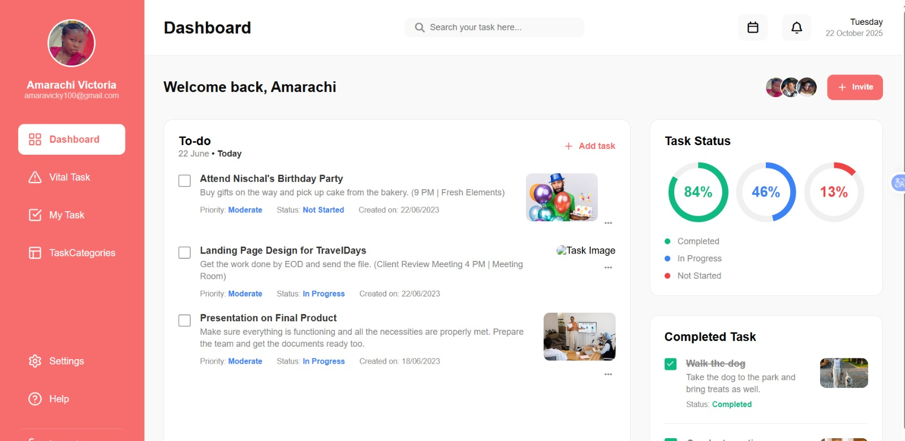
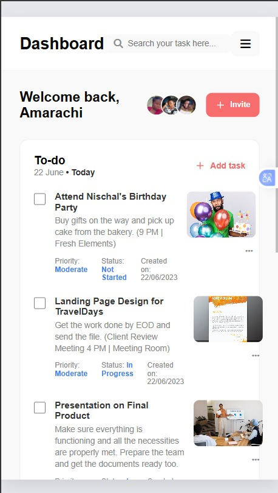

# To-Do App

## Overview
This is a simple and responsive To-Do application that allows users to manage daily tasks efficiently. It helps users stay organized by adding, completing, and deleting tasks.

## Problem It Solves
Many people struggle with staying organized and tracking tasks. This application provides a simple interface to:
- Keep track of tasks
- Stay productive
- Manage daily activities effectively

## Features
- Add new tasks
- Mark tasks as completed
- Delete tasks
- Responsive design for mobile and desktop

## Preview

## Problems I Solved
- Ensured tasks update dynamically without breaking the UI
- Fixed layout issues for better responsiveness on smaller screens
- Improved usability by making interactions simple and intuitive

## Technologies Used
- HTML
- CSS

## How to Run
1. Clone the repository
2. Open the project folder
3. Open `index.html` in your browser

## Future Improvements
- Add local storage to save tasks
- Add task categories and priorities
- Improve UI design and animations

## Lessons Learned
- Managing user input effectively
- Importance of responsive design
